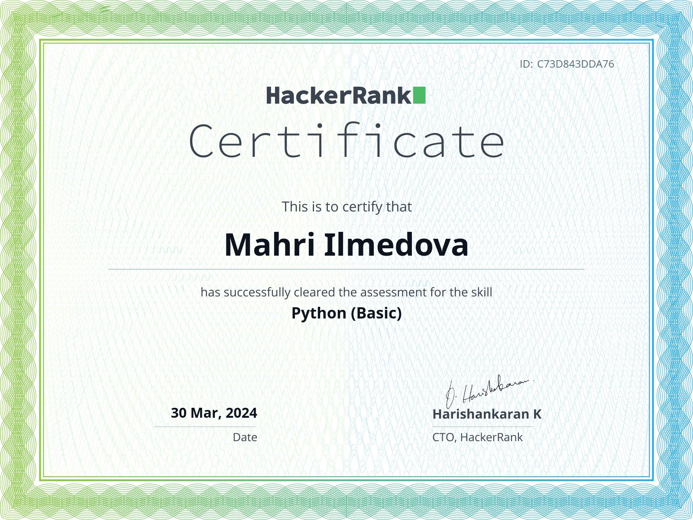

<!--<h3 align="center">🏆 Github Achievements 🏆</h3>
  -->
<!-- <table>
  <tr>
    <td valign="top">
      
    </td>
    <td valign="center" align="center">
     
    </td>
  </tr>
</table> -->

<!---

<h3>📜 Certifications </h3>

    
    

-->
