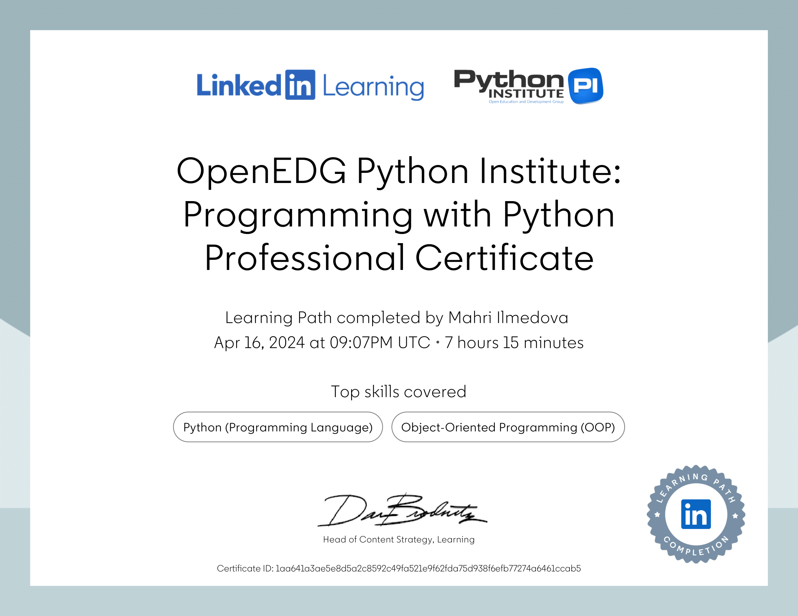

<!-- -->
###
 
<h2>
  Hey there! 👋 I'm Mahri Ilmedova
</h2>

<h3>🧑‍💻 About Me</h3>

  I turn coffee ☕ into code that powers the world 🌠 
  Whether it's building scalable systems or crafting sleek interfaces, I'm all about writing code that’s both elegant and efficient. 🚀

<h3>💡 What Drives Me</h3>
<ul>
  <li>Problem Solving: There’s nothing quite like the thrill of cracking a complex problem and turning it into a seamless solution.</li>
  <li>Continuous Learning: Always curious, always leveling up! Whether it’s mastering algorithms or diving into enterprise-level system design, I love sharpening my tools.</li>
  <li>Collaborative Building: I enjoy collaborating with others, contributing to open-source projects, and being part of communities that push the boundaries of what's possible.</li>
</ul>

<h3> ❤️ Things I Love</h3>
<ul>
  <li>💻 Building real-world applications that scale, sustain, and adapt.</li>
  <li>🧠 Exploring data structures and algorithms to optimize everything I create.</li>
  <li>🤖 Collaborating with the community through open-source contributions and knowledge sharing.</li>
</ul>
<h3>🌱 Currently</h3>

  I'm on a journey to master the intricacies of enterprise-level development, delving into advanced algorithms, and building robust, scalable applications that make a difference.

<h3>🎨 When I'm Not Coding</h3>

You might find me:

<ul>
  <li>Daydreaming about new projects or perfecting the art of minimalism.</li>
  <li>Exploring tech news and trends.</li>
  <li>Hiking trails and capturing sunsets through my camera lens.</li>
</ul>
<h3>🚀 Let's Connect</h3>

I'm always excited to connect with fellow developers, learners, and innovators. Feel free to explore my projects, provide feedback, or just say hi! Here is my: <a href="https://www.linkedin.com/in/mahri-ilmedova/">LinkedIn account</a> Let's innovate together! 

<h3>🏆 Github stats </h3>
  

<h3>🧠 Leetcode stats </h3>

   

<!---

<h3>📜 Certifications </h3>

    
    

-->
